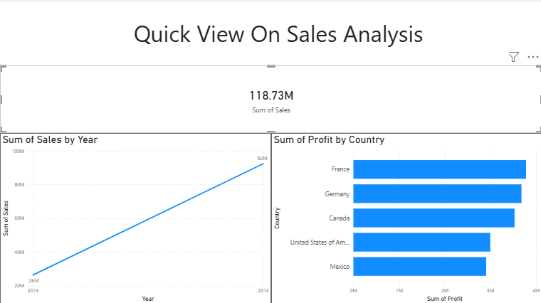

# Data-Analyst-Portfolio

## About Me
Hi! I'm Devika Kolla. I am an aspiring Data Analyst, focused on transforming raw data into actionable business insights through SQL, Python, and visualization tools.

## Technical stack   
**Databases:** SQL (My SQL)
**Data Manipulation: **Python (Pandas,Numpy), Excel
**Data Visualization: ** Power BI
**Version Control:** GitHub

## My Power BI Dashboard

## Key Business Insights
Based on my analysis of the global financialdata:
** Total Sales Performance: ** The Company achived **$118.73M ** in total sales, showing a strong upward trend year-over-year.
** Top Profit Drivers: ** ** France ** and ** Germany ** are the most profitable markets.
** Product Strategy : **while **Paseo ** is a top performer, products like **VTT** show negativ margins in specific regions, indicating an area for cost optimization.

